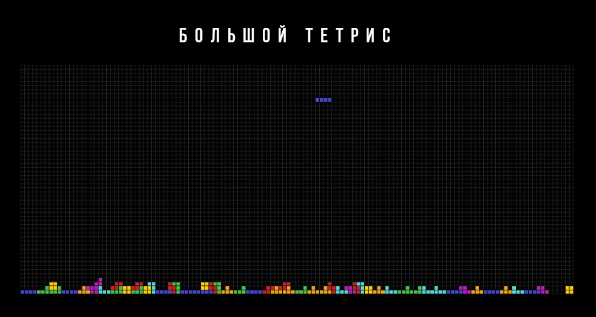

## Большой Тетрис




Это простая реализация игры Тетрис на JavaScript. Игра включает в себя основные механики, такие как вращение фигур, движение и удаление заполненных линий.

## 📥 Установка

1.  Склонируйте репозиторий:

    ```
    git clone https://github.com/rwolfin/tetris.git
    ```

2.  Откройте файл `index.html` в вашем браузере.

3. Или скачайте готовый 🔗 [ZIP Архив](https://github.com/rwolfin/tetris/archive/refs/heads/main.zip)

## 🛠️ Используемые технологии

-   HTML
-   CSS
-   JavaScript

## 🎮 Как играть

-   Используйте стрелки влево и вправо для перемещения фигур.
-   Нажмите стрелку вверх для вращения фигуры.
-   Нажмите стрелку вниз для ускорения падения фигуры.

## 🚀 Возможности

-   Счетчик очков
-   Анимации


Если вы хотите внести свой вклад, пожалуйста, создайте форк репозитория и отправьте пулл-реквест.
